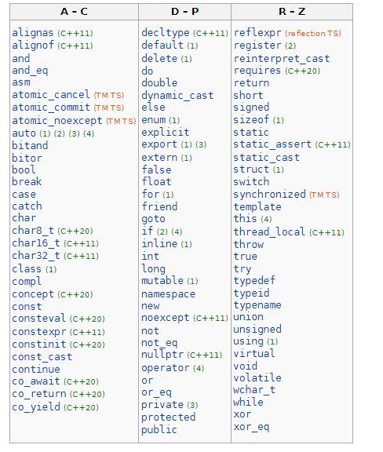
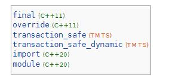
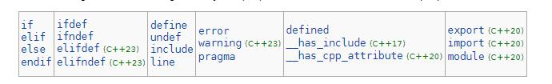
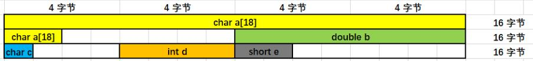

# 1.C++关键字

以下是cppreference.com给出的现在C++的一些关键字，后面带C++11的代表在C++的某一个版本特性中新增的



除了上述关键字之外还有一些特殊标识符，如下



除了上述之外还有预处理的即`#`开头的，如下



接下来部分，我会按照自己即cpprefernce的一些内容做出关于关键字部分的解析。

## alignas(c++11)

`alignas`是用来指定对象对齐要求。

如果对齐后，计算机会方便读取，比如。



看上面这一张图就比较明显了。如果a数组是18个字节，那莪它就要占用第二行的2个字节，如果是按8字节去存储的，那么下次`b`的存储就要在后面，从而会浪费一定的空间。

这部分学过计算机组成原理可能会理解的更加好点。

使用规范是

```
alignas(表达式)
```

接下来是`alignas`的几个对齐示例：

```cpp
//对齐变量
alignas(16) char array[64]; //数组将被对齐到16字节边界

//对齐类型
struct alignas(32) AlignedStruct{
    int a;
    double b;
    char c[24];
    
};//AlignedStruct按照32字节对齐
//对齐类成员
class MyClass{
public:
	alignas(8) int member;//这个成员被对齐到8字节边界    
};
```

注:

* 在表达式里面的数字需要是2的幂次方。且不能小于类型或对象的默认对齐。
* 可以使用`alignof`运算符查询类型或变量的对齐。

总结一下：可以通过`alignas`利用特定硬件能力进行程序执行效率的优化。

## alignof(c++11)

返回某个变量的对齐位

示例

```cpp
struct alignas(64) Empty64 {};
"  with alignas(64): " << alignof(Empty64) << "\n";
```

上述结果可能为:

```
with alignas(64): 64
```

## and

这个就很好理解了`与`运算。和`&&`是一样的用法。

只有全部true才为true，其余都为false。

```cpp
int main()
{
    static_assert((false and false) == false);
    static_assert((false and true)  == false);
    static_assert((true  and false) == false);
    static_assert((true  and true)  == true);
}
```

## and_eq

这个操作符和`&=`操作符一样，是将左边和右边进行相与运算。

示例：

```
1100 and eq 0111
结果:0100
```

对于没有结果过相与运算的，看下面

```
1100
0111
____
0100
```

上面与下面对应位置相与，只有全部为1的时候结果才为1。

C++代码示例：

```cpp
#include <bitset>
#include <iostream>
 
int main()
{
    std::bitset<4> mask("1100");
    std::bitset<4> val("0111");
    val and_eq mask;
    std::cout << val << '\n';
}
```

运算结果:`0100`